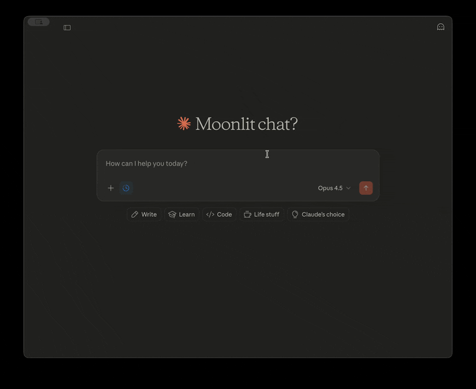

# UK Charities MCP Server

Query UK charity data from Claude.

[](https://pypi.org/project/uk-charities-mcp/)
[](https://www.python.org/downloads/)
[](https://opensource.org/licenses/MIT)
[](https://modelcontextprotocol.io/)

## Demo



## Quick Start

**Prerequisites:** Free API key from [api-portal.charitycommission.gov.uk](https://api-portal.charitycommission.gov.uk/)

Add to your Claude Desktop config:

- **macOS**: `~/Library/Application Support/Claude/claude_desktop_config.json`
- **Windows**: `%APPDATA%\Claude\claude_desktop_config.json`

### Option 1: Via PyPI (recommended)

```json
{
  "mcpServers": {
    "uk-charities": {
      "command": "uvx",
      "args": ["uk-charities-mcp"],
      "env": {
        "CCEW_API_KEY": "your-api-key-here"
      }
    }
  }
}
```

### Option 2: From source

```bash
git clone https://github.com/w4sspr/uk-charities-mcp.git
cd uk-charities-mcp
uv sync
```

```json
{
  "mcpServers": {
    "uk-charities": {
      "command": "uv",
      "args": ["run", "--directory", "/path/to/uk-charities-mcp", "uk-charities-mcp"],
      "env": {
        "CCEW_API_KEY": "your-api-key-here"
      }
    }
  }
}
```

> **Troubleshooting:** If you get `spawn uvx ENOENT` or `spawn uv ENOENT`, Claude Desktop can't find the executable. Use the full path instead (run `which uvx` or `which uv` to find it, e.g., `/Users/you/.local/bin/uvx`).

Restart Claude Desktop, then try:

> "Get details for Oxfam (charity 202918)"

## Example Prompts

- "Get details for charity 202918" (Oxfam)
- "Show me the financial history for the British Heart Foundation (225971)"
- "Who are the trustees of Cancer Research UK (1089464)?"
- "What are the charitable objects of the RSPCA (219099)?"

**Note:** This MCP requires charity registration numbers. Find them at [register-of-charities.charitycommission.gov.uk](https://register-of-charities.charitycommission.gov.uk/)

| Example Charities | Registration # |
|-------------------|----------------|
| Oxfam | 202918 |
| British Heart Foundation | 225971 |
| Cancer Research UK | 1089464 |
| RSPCA | 219099 |
| Save the Children | 213890 |

## Tools

### `get_charity_details`

Full charity info: name, status, contact, trustees, causes, beneficiaries, latest income/spending.

| Parameter | Type | Description |
|-----------|------|-------------|
| `registration_number` | int | Charity registration number |

### `get_charity_financials`

Up to 5 years of detailed financial records.

| Parameter | Type | Description |
|-----------|------|-------------|
| `registration_number` | int | Charity registration number |

Returns breakdowns: donations & legacies, charitable activities, trading, investments, government grants, fundraising, governance.

### `get_charity_trustees`

List of current trustees.

| Parameter | Type | Description |
|-----------|------|-------------|
| `registration_number` | int | Charity registration number |

### `get_governing_document`

Charitable objects (mission), governing document description, area of benefit.

| Parameter | Type | Description |
|-----------|------|-------------|
| `registration_number` | int | Charity registration number |

## Limitations

- **No search by name** — CCEW API has no search endpoint; you must provide the registration number
- **England & Wales only** — Scotland uses [OSCR](https://www.oscr.org.uk/), Northern Ireland uses [CCNI](https://www.charitycommissionni.org.uk/)
- **No aggregate statistics** — can't query "largest charities" or sector-wide stats
- **Current trustees only** — API doesn't provide historical trustee records

**Prompts that won't work:**
- "Find mental health charities in London" (no search by cause/location)
- "List the largest charities by income" (no ranking)
- "How many charities are there in the UK?" (no aggregate stats)

## Roadmap

- [ ] Scotland charities via [OSCR API](https://www.oscr.org.uk/)
- [ ] Northern Ireland charities via [CCNI API](https://www.charitycommissionni.org.uk/)
- [ ] Caching layer to reduce API calls
- [ ] Bulk lookup for comparing multiple charities

## Development

```bash
# Run tests
export CCEW_API_KEY=your-api-key
uv run pytest tests/ -v

# Test with MCP Inspector
CCEW_API_KEY=your-api-key uv run mcp dev src/uk_charities_mcp/server.py
```

## See Also

> **Why I built this:** MCP integration with UK public sector data APIs. See also: [food-hygiene-mcp](https://github.com/w4sspr/food-hygiene-mcp) for FSA food hygiene ratings.

## Data Source

[Charity Commission API](https://api-portal.charitycommission.gov.uk/) — free, requires API key.

## License

MIT
